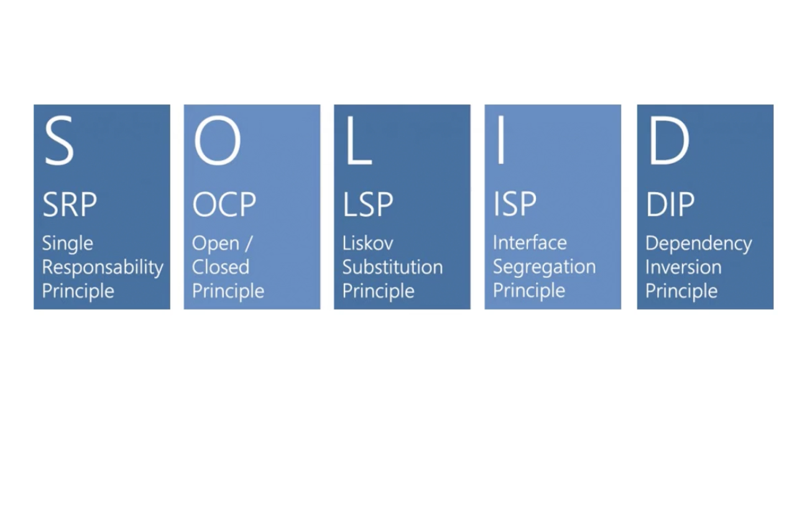
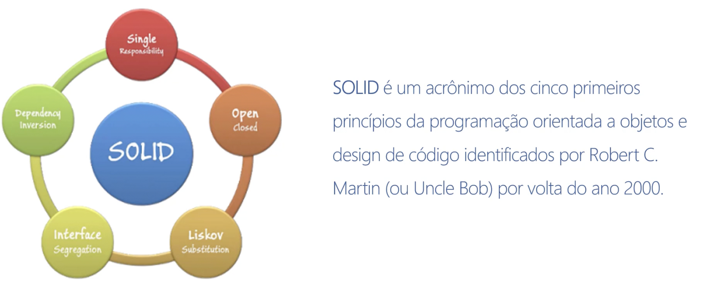
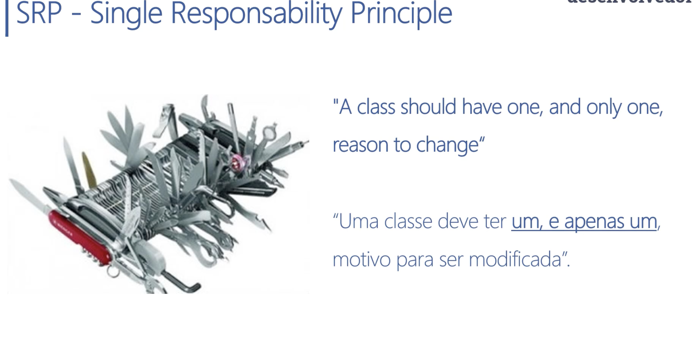
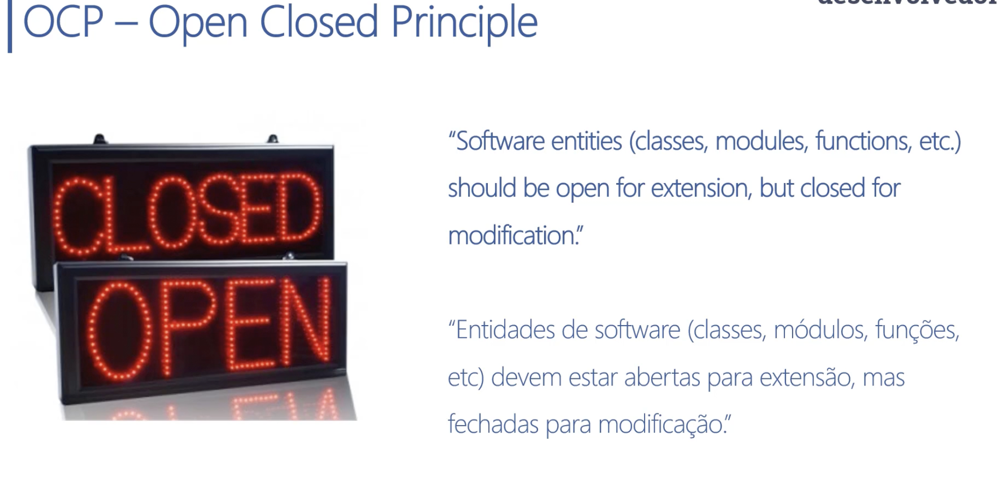
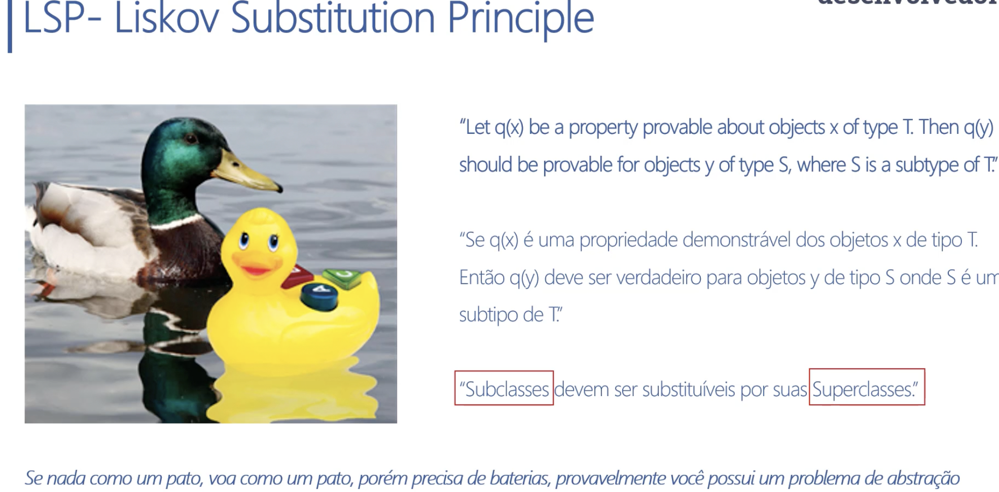
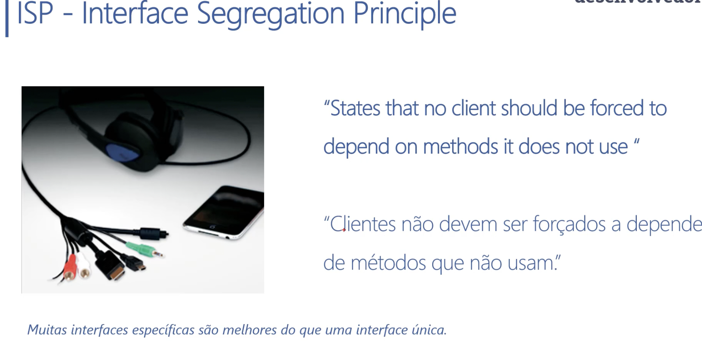
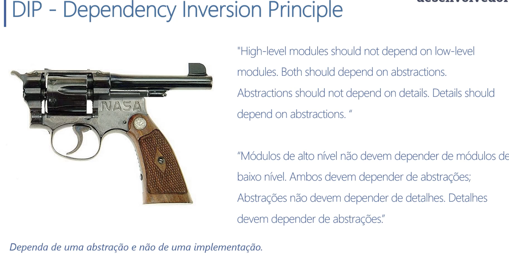

# Princípio SOLID

Este é um guia básico sobre os princípios SOLID, que são um conjunto de diretrizes para escrever código limpo, modular e de fácil manutenção.

## S - Single Responsibility Principle (Princípio da Responsabilidade Única)

Cada classe deve ter apenas uma responsabilidade. Isso facilita a manutenção, reutilização e testabilidade do código.

## O - Open/Closed Principle (Princípio do Aberto/Fechado)

As entidades de software devem estar abertas para extensão, mas fechadas para modificação. Isso significa que você pode adicionar novos recursos sem alterar o código existente.

## L - Liskov Substitution Principle (Princípio da Substituição de Liskov)

As classes derivadas devem ser substituíveis por suas classes base sem afetar a integridade do sistema. Isso garante que o comportamento esperado seja mantido em todas as instâncias.

Este principio garante que a herança foi realizada corretamente.

## I - Interface Segregation Principle (Princípio da Segregação de Interfaces)

As interfaces devem ser específicas para os clientes que as utilizam. Isso evita que as classes dependam de métodos que não precisam.

## D - Dependency Inversion Principle (Princípio da Inversão de Dependência)

Os módulos de alto nível não devem depender de módulos de baixo nível. Ambos devem depender de abstrações. Isso permite que o código seja mais flexível e fácil de testar.

## Conclusão

Ao seguir os princípios SOLID, você estará escrevendo código mais limpo, modular e de fácil manutenção. Isso resultará em um sistema mais robusto e escalável.
